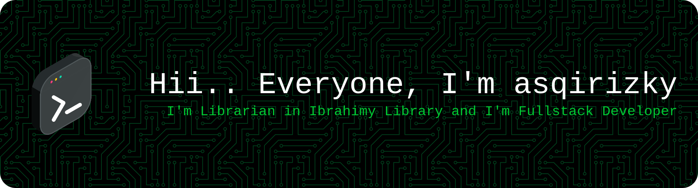

# Hii.. nice to meet you 👋 

## 🌐 Socials:
  

### 💻 Tech Stack:
  
   
### 📊 GitHub Stats:
 
 

### Play With Me:
<picture>
  <source media="(prefers-color-scheme: dark)" srcset="https://raw.githubusercontent.com/asqirizky/asqirizky/output/pacman-contribution-graph-dark.svg">
  <source media="(prefers-color-scheme: light)" srcset="https://raw.githubusercontent.com/asqirizky/asqirizky/output/pacman-contribution-graph.svg">
  
</picture>

---

